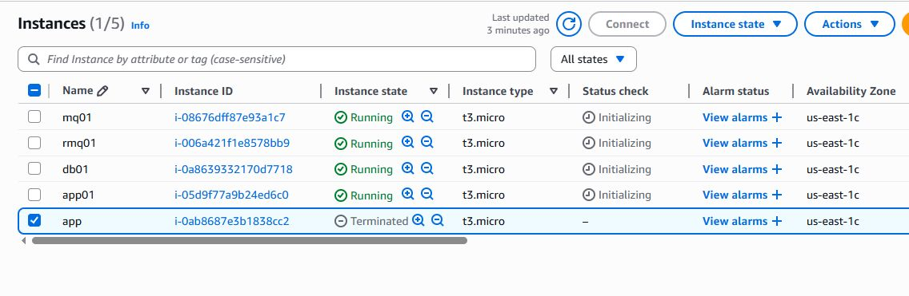

#  VProfile Lift & Shift

### On-Prem Environment

This diagram represents the original on-premises infrastructure before migration. The environment was designed using a traditional multi-tier architecture consisting of : 

- NGINX as the load balancer
- Apache Tomcat application servers 
- MySQL database server 
- RabbitMQ messaging service 
- Memcached caching layer 

The goal was to replicate this architecture in AWS while maintaining application functionality and minimizing code changes.

---

### AWS Architecture

This architecture shows the Lift & Shift migration of the VProfile application to AWS.
Key components include  :

- Custom VPC with public and private subnets
- Application Load Balancer (ALB) 
- Auto Scaling Group for application servers 
- EC2 instances for application and backend services 
- Route 53 for DNS management 
- CloudWatch for monitoring 
- IAM roles for secure service access 

The migration focused on infrastructure transformation rather than application refactoring.

---

### EC2 Instances

This screenshot displays the EC2 instances used to host the application and supporting services.
Each component was deployed on a dedicated instance  :

* app01 → Apache Tomcat 
* db01 → MySQL Database 
* rmq01 → RabbitMQ 
* mc01 → Memcached 

This separation improves maintainability and closely resembles production environments.

---

### Security Groups

Security Groups were configured using a tier-based access model. Examples  :

* ALB accepts inbound HTTP traffic
* Application servers accept traffic only from the ALB 
* Backend services accept traffic only from the application tier

This design follows the principle of least privilege and enhances security.

---

### Route 53 Configuration

Amazon Route 53 was used to manage DNS records for both public and private services.

Features implemented  :

* Public Hosted Zone for external application access 
* Private Hosted Zone for internal service communication 
* DNS-based service discovery 

This simplifies infrastructure management and improves scalability.

---

### Target Group Health Check

Application instances were registered in an Application Load Balancer Target Group.

Health checks continuously verify application availability.

Benefits  :

* Automatic traffic routing to healthy instances 
* Improved reliability 
* Better user experience

---

## Application

### Login Page

This login page confirms successful deployment of the application on AWS infrastructure.
Successful access verifies  :

* ALB configuration 
* Route 53 DNS resolution 
* Tomcat deployment 
* Backend service connectivity

### Dashboard

The dashboard demonstrates that the application is fully operational after migration.

It confirms : 
* Database connectivity 
* Session management 
* Messaging integration 
* End-to-end functionality 

This serves as the final validation step for the Lift & Shift migration project.

# Prerequisites
- JDK 17 or 21
- Maven 3.9
- MySQL 8

# Technologies 
- Spring MVC
- Spring Security
- Spring Data JPA
- Maven
- JSP
- Tomcat
- MySQL
- Memcached
- Rabbitmq
- ElasticSearch

# Database
Here,we used Mysql DB 
sql dump file:
- /src/main/resources/db_backup.sql
- db_backup.sql file is a mysql dump file.we have to import this dump to mysql db server
- > mysql -u <user_name> -p accounts < db_backup.sql

