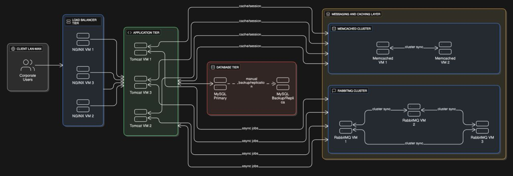
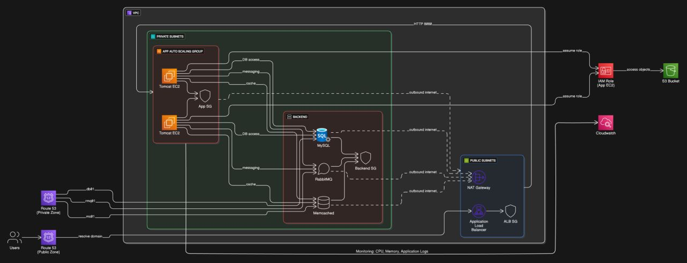
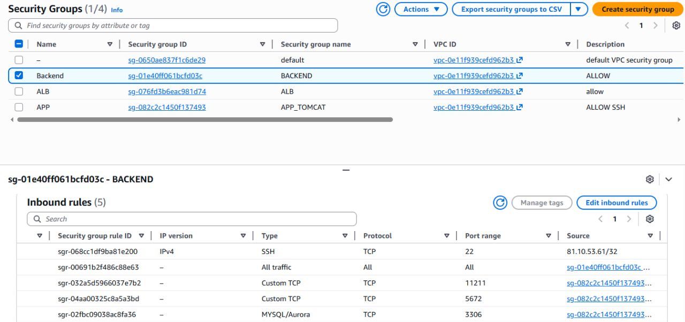
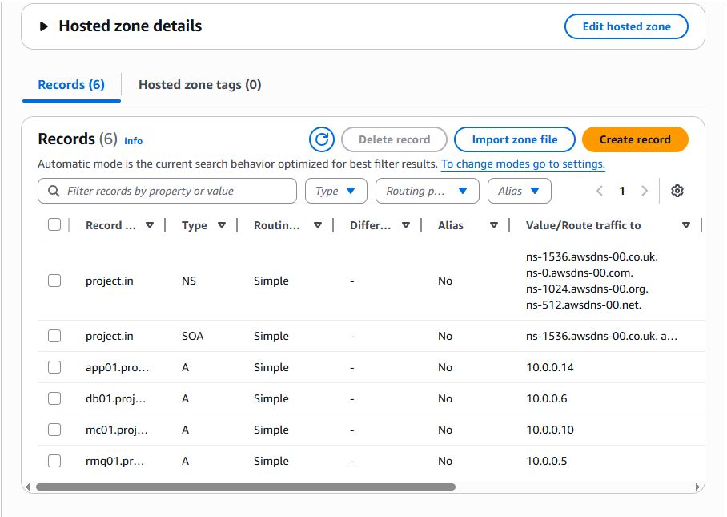
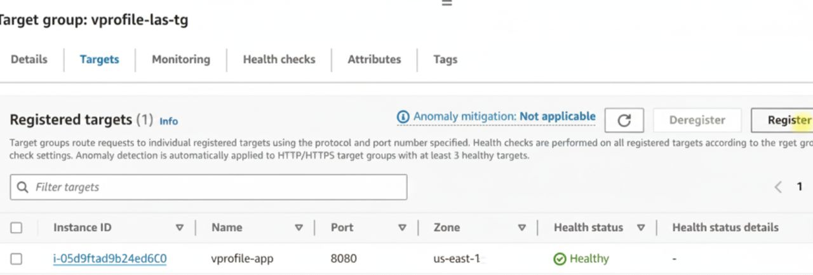
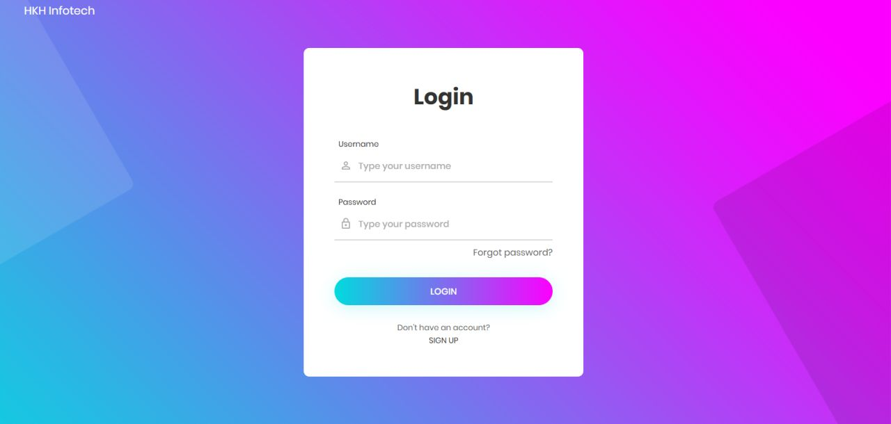
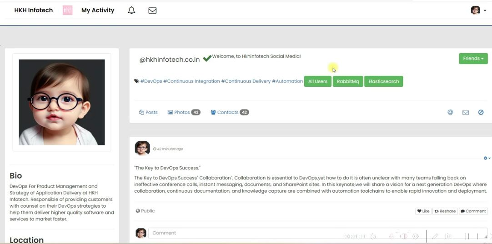

# 🚀 VProfile Lift & Shift Migration

## Architecture Overview

### On-Prem Environment

This diagram illustrates the original on-premises multi-tier architecture before migration to AWS.

---

### AWS Architecture

The original environment was migrated to AWS using a Lift & Shift approach.

---

## Infrastructure

### EC2 Instances

Application and backend services deployed on EC2 instances.

---

### Security Groups

Tier-based security model controlling communication between components.

---

### Route 53

Public and private hosted zones for DNS resolution.

---

### Target Group Health Check

Application Load Balancer target group health monitoring.

---

## Application

### Login Page

Application login interface running on AWS infrastructure.

### Dashboard

Successful application deployment validation after migration.

# Prerequisites
- JDK 17 or 21
- Maven 3.9
- MySQL 8

# Technologies 
- Spring MVC
- Spring Security
- Spring Data JPA
- Maven
- JSP
- Tomcat
- MySQL
- Memcached
- Rabbitmq
- ElasticSearch

# Database
Here,we used Mysql DB 
sql dump file:
- /src/main/resources/db_backup.sql
- db_backup.sql file is a mysql dump file.we have to import this dump to mysql db server
- > mysql -u <user_name> -p accounts < db_backup.sql

